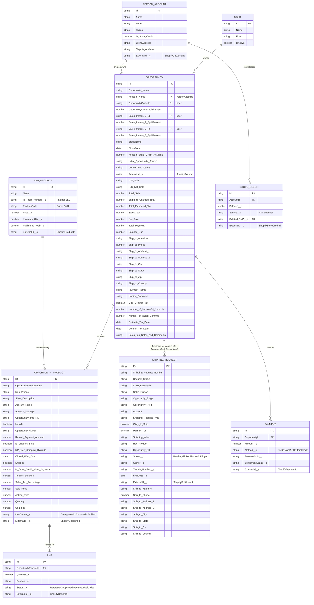

```mermaid
erDiagram
  PERSON_ACCOUNT ||--o{ OPPORTUNITY : "creates/owns"
  USER ||--o{ OPPORTUNITY : "owner"
  RAU_PRODUCT ||--o{ OPPORTUNITY_PRODUCT : "referenced by"
  OPPORTUNITY ||--o{ OPPORTUNITY_PRODUCT : "contains"
  OPPORTUNITY ||--o{ SHIPPING_REQUEST : "fulfillment for stage in {On Approval, CwC, Closed Won}"
  OPPORTUNITY_PRODUCT ||--o{ RMA : "returns for"
  OPPORTUNITY ||--o{ PAYMENT : "paid by"
  PERSON_ACCOUNT ||--o{ STORE_CREDIT : "credit ledger"

  PERSON_ACCOUNT {
    string Id PK
    string Name
    string Email
    string Phone
    number In_Store_Credit
    string BillingAddress
    string ShippingAddress
    string ExternalId__c "ShopifyCustomerId"
  }

  USER {
    string Id PK
    string Name
    string Email
    boolean IsActive
  }

  RAU_PRODUCT {
    string Id PK
    string Name
    string RP_Item_Number__c "Internal SKU"
    string ProductCode "Public SKU"
    number Price__c
    number Inventory_Qty__c
    boolean Publish_to_Web__c
    string ExternalId__c "ShopifyProductId"
  }

  OPPORTUNITY {
    string Id PK
    string Opportunity_Name
    string Account_Name FK "PersonAccount"
    string OpportunityOwnerId FK "User"
    number OpportunityOwnerSplitPercent
    string Sales_Person_2_Id FK "User"
    number Sales_Person_2_SplitPercent
    string Sales_Person_3_Id FK "User"
    number Sales_Person_3_SplitPercent
    string StageName
    date CloseDate
    number Account_Store_Credit_Available
    string Initial_Opportunity_Source
    string Conversion_Source
    string ExternalId__c "ShopifyOrderId"
    string IOS_Split
    string IOS_Net_Sale
    number Total_Sale
    number Shipping_Charged_Total
    number Total_Estimated_Tax
    number Sales_Tax
    number Net_Sale
    number Total_Payment
    number Balance_Due
    string Ship_to_Attention
    number Ship_to_Phone
    string Ship_to_Address_1
    string Ship_to_Address_2
    string Ship_to_City
    string Ship_to_State
    string Ship_to_Zip
    string Ship_to_Country
    string Payment_Terms
    string Invoice_Comment
    boolean Opp_Commit_Tax
    number Number_of_Successful_Commits
    number Number_of_Failed_Commits
    date Estimate_Tax_Date
    date Commit_Tax_Date
    string Sales_Tax_Notes_and_Comments
  }

  OPPORTUNITY_PRODUCT {
    string ID PK
    string OpportunityProductName
    string Rau_Product
    string Short_Description
    string Account_Name
    string Account_Manager
    string OpportunityName_FK
    boolean Include
    string Opportunity_Owner
    number Refund_Payment_Amount
    boolean Is_Ongoing_Sale
    boolean RP_Free_Shipping_Override
    date Closed_Won_Date
    boolean Shipped
    number In_Store_Credit_Initial_Payment
    number Taxable_Balance
    number Sales_Tax_Percentage
    number Sale_Price
    number Asking_Price
    number Quantity
    number UnitPrice
    string LineStatus__c "On Approval / Returned / Fulfilled"
    string ExternalId__c "ShopifyLineItemId"
  }

  SHIPPING_REQUEST {
    string ID PK
    string Shipping_Request_Number
    string Request_Status
    string Short_Description
    string Sales_Person
    string Opportunity_Stage
    string Opportunity_Prod
    string Account
    string Shipping_Request_Type
    boolean Okay_to_Ship
    boolean Paid_in_Full
    string Shipping_When
    string Rau_Product
    string Opportunity_FK
    string Status__c "Pending/Picked/Packed/Shipped"
    string Carrier__c
    string TrackingNumber__c
    date ShipDate__c
    string ExternalId__c "ShopifyFulfillmentId"
    string Ship_to_Attention
    number Ship_to_Phone
    string Ship_to_Address_1
    string Ship_to_Address_2
    string Ship_to_City
    string Ship_to_State
    string Ship_to_Zip
    string Ship_to_Country
  }

  RMA {
    string Id PK
    string OpportunityProductId FK
    number Quantity__c
    string Reason__c
    string Status__c "Requested/Approved/Received/Refunded"
    string ExternalId__c "ShopifyReturnId"
  }

  PAYMENT {
    string Id PK
    string OpportunityId FK
    number Amount__c
    string Method__c "Card/Cash/ACH/StoreCredit"
    string TransactionId__c
    string SettlementStatus__c
    string ExternalId__c "ShopifyPaymentId"
  }

  STORE_CREDIT {
    string Id PK
    string AccountId FK
    number Balance__c
    string Source__c "RMA/Manual"
    string Related_RMA__c FK
    string ExternalId__c "ShopifyStoreCreditId"
  }

```
